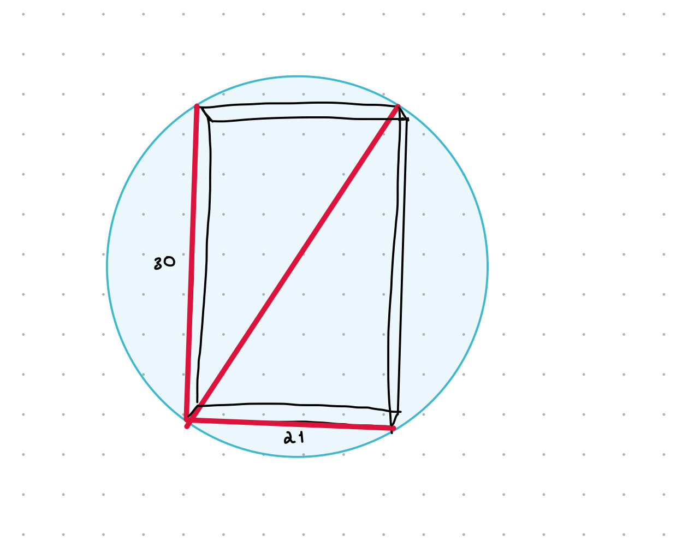

Como parte de la modernización de nuestras video rental stores, vamos a automatizar la recepción y entrega de discos con robots.
Parte de la infraestructura es diseñar contenedores cilíndricos giratorios para facilitar la colocación y extracción de discos 
por brazos automatizados. Cada cajita de Blu-Ray mide 20cm x 13.5cm x 1.5cm, y para que el brazo pueda manipular adecuadamente 
cada cajita, debe estar contenida dentro de un arnés que cambia las medidas a 30cm x 21cm x 8cm para un espacio total de 5040 
centímetros cúbicos y un peso de 500 gr por película.

Se nos ha encargado formular la medida de dichos cilindros de manera tal que quepan todas las copias de los Blu-Rays de cada uno de nuestros stores. 
Las medidas deben ser estándar, es decir, la misma para todas nuestras stores, y en cada store pueden ser instalados más de 1 de estos cilindros. 
Cada cilindro aguanta un peso máximo de 50kg como máximo. El volúmen de un cilindro se calcula de [ésta forma.](volume of a cylinder)

Esto no se resuelve con 1 solo query. El problema se debe partir en varios cachos y deben resolver cada uno con SQL.

La información que no esté dada por el enunciado del problema o el contenido de la BD, podrá ser establecida como supuestos o assumptions, 
pero deben ser razonables para el problem domain que estamos tratando.

# Análisis:
- cada pelicula con el arnes tiene un volumen 5,040 cm³ 
- cada cilindro aguanta 50kg y cada pelicula peso 500 gr  50/0.5=100 peliculas caben

- dado el acomodo de la pelicula con arnes dentro del cilindro calculamos:


cilindro:
- diametro 36.619 diametro = sqrt(30²+21²) 
- radio: 18.309  radio = diametro/2
- altura:  100*(8 cm de grosor (pelicula)) 

formula del volumne del cilindro: pi(radio²)altura

---- capacidad del cilindro:
```sql
SELECT 5040*(50/0.5); ---- el volúmen del cilindro debe de ser mayor o igual a 504,000. 


SELECT sqrt(21^2+30^2)/2; ----el radio de la base debe aprox 18.31 cm.

SELECT 100*8; ---- altura


---- volúmen de  cilindro pi*radio²*altura
select pi()*((21^2+30^2)/4)*100*8;


---peliculas por store
select count(i.film_id) as num_peliculas,s.store_id
from inventory i 
inner join store s on (i.store_id =s.store_id )
group by s.store_id;

--- ¿cuantos cilindros necesitamos por tienda?
select num_peliculas/100 as num_cilindros, a.store_id
from (
	select count(i.film_id) as num_peliculas,s.store_id 
	from inventory i 
	inner join store s on (i.store_id =s.store_id )
	group by s.store_id
) as a;
```


